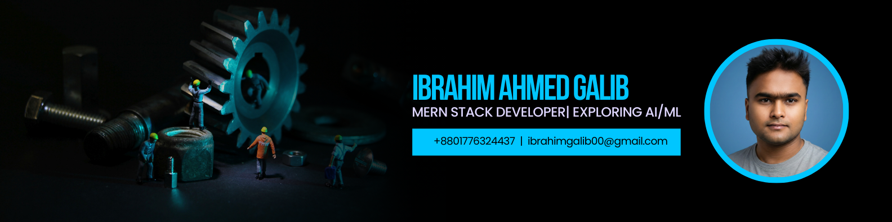

<!-- ======================= HERO BANNER ======================= -->

  

<!-- ======================= ANIMATED NAME ======================= -->
<h1 align="center">
  
</h1>

<h3 align="center">💻 MERN Stack Web Developer</h3>

  📍 Dhaka, Bangladesh &nbsp; • &nbsp;
  📧 <a href="mailto:ibrahimgalib00@gmail.com">ibrahimgalib00@gmail.com</a>

<!-- ======================= TYPING ANIMATION ======================= -->

  

<!-- ======================= SOCIAL + VISITOR ======================= -->

  
  
  

<!-- ======================= ABOUT ======================= -->
## 👨‍💻 About Me
✨ **MERN Stack Web Developer** with a strong **Computer Science foundation**  
✨ Passionate about **modern, scalable, production-ready applications**  
✨ Improving **backend architecture** while exploring **AI & ML**

> 💡 *Learning by building real-world systems, not just tutorials.*

<!-- ======================= EDUCATION ======================= -->
## 🎓 Academic Background
🎓 **BSc in Computer Science & Engineering**  
🏫 *Daffodil International University*

📚 Core Strengths:
- C, C++
- Java
- Data Structures & Algorithms
- Problem Solving

<!-- ======================= CURRENT WORK ======================= -->
## 🔭 What I’m Doing Now
- 🌱 Learning **Next.js**
- 🛠 Building **Full-Stack MERN Applications**
- ⚙ Working with **REST APIs & Databases**
- 🧠 Exploring **AI & Machine Learning**

<!-- ======================= TECH STACK ======================= -->
## 🛠 Tech Stack

  

<!-- ======================= PROJECTS ======================= -->
## 🚀 Featured Projects

<table width="100%">
  <tr>
    <td width="33%" align="center">
      <h3>🎓 E-Tutor Platform</h3>
      
MERN tuition management system with role-based auth

      <a href="https://github.com/galibhub/e-tuitor-client">🔗 View Code</a>
    </td>
    <td width="33%" align="center">
      <h3>🛒 Export–Import System</h3>
      
Client-side export-import workflow manager

      <a href="https://github.com/galibhub/export-import-client">🔗 View Code</a>
    </td>
    <td width="33%" align="center">
      <h3>🦸 Hero App</h3>
      
JavaScript frontend concept project

      <a href="https://github.com/galibhub/hero-app">🔗 View Code</a>
    </td>
  </tr>
</table>

<!-- ======================= ACTIVITY & CONTRIBUTION ======================= -->
## 📊 Activity & Contributions

  
  

  

  

<!-- ======================= GOALS ======================= -->
## 🎯 Goals
- ✅ Become **job-ready MERN Developer**
- 🚀 Build **scalable real-world systems**
- 🧠 Improve **problem-solving & system design**
- 🌱 Continuously learn modern web tech

  <i>“Consistency compounds over time. Keep building 🚀”</i>

