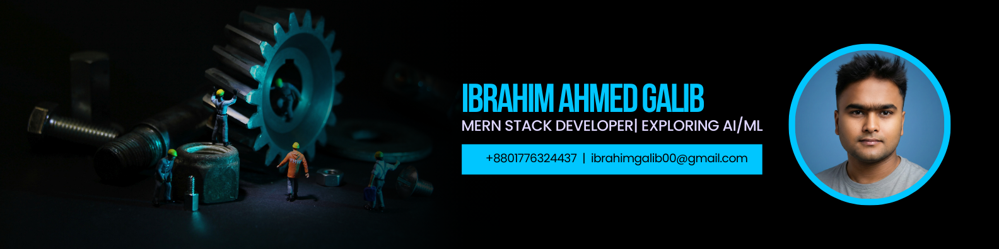

```markdown
<!-- BANNER -->


<!-- HEADER WAVE -->


<br/>

<!-- TYPING ANIMATION -->
<div align="center">
  <a href="https://github.com/galibhub">
    
  </a>
</div>

<br/>

<!-- SOCIAL BADGES & VIEWS -->
<div align="center">
  <a href="https://www.linkedin.com/in/ibrahim-ahmed-galib/" target="_blank">
    
  </a>&nbsp;
  <a href="mailto:ibrahimgalib00@gmail.com">
    
  </a>&nbsp;
  <a href="https://github.com/galibhub" target="_blank">
    
  </a>
  <br/><br/>
  
</div>

<br/>

---

## 🧑‍💻 About Me

<table border="0" cellpadding="12" width="100%">
<tr>
<td width="52%" valign="top">

I'm a passionate **Full Stack Developer** from **Dhaka, Bangladesh 🇧🇩**, dedicated to crafting scalable, production-ready web applications. I love turning complex problems into clean, elegant code.

<br/>

| | |
|--|--|
| 🔭 **Currently** | Engineering a large-scale MERN app |
| 🌱 **Learning** | TypeScript & Next.js |
| 🎯 **Goal** | Building impactful real-world solutions |
| 🤖 **Exploring** | AI & Machine Learning |
| 📍 **Location** | Dhaka, Bangladesh |
| 📫 **Email** | ibrahimgalib00@gmail.com |

<br/>


</td>

<td width="48%" valign="center" align="center">


<br/>


</td>
</tr>
</table>

---

## 🛠️ Tech Stack

<div align="center">

**⚡ Frontend Development**


**🔧 Backend & Database**


**🔨 Tools & Platforms**


<br/>


</div>

---

## 📊 GitHub Statistics

<div align="center">


<br/><br/>


</div>

<br/>

<!-- CONTRIBUTION GRAPH -->
<div align="center">
  
</div>

---

## 🚀 Featured Projects

<div align="center">

<table width="100%" border="0" cellpadding="16" cellspacing="0">
<tr>

<!-- Project 01 -->
<td width="33%" valign="top">

<div align="center">


<h3>🎓 E-Tutor Platform</h3>

<p>
A scalable tuition management platform connecting students and tutors through a structured digital workflow.
</p>


<br/><br/>

🔐 JWT Authentication  
<br/>
👨‍🎓 Student–Tutor Workflow  
<br/>
📱 Responsive Interface  
<br/>
⚙️ Role-Based Access Control

<br/><br/>

<a href="https://github.com/galibhub/e-tuitor-client">

</a>

</div>

</td>

<!-- Project 02 -->
<td width="33%" valign="top">

<div align="center">


<h3>📦 Export–Import System</h3>

<p>
A business workflow platform designed to simplify product management, operational processes, and real-time business tracking.
</p>


<br/><br/>

📦 Product Management  
<br/>
🔄 Workflow Automation  
<br/>
📊 Business Dashboard  
<br/>
☁️ Firebase Integration

<br/><br/>

<a href="https://github.com/galibhub/export-import-client">

</a>

</div>

</td>

<!-- Project 03 -->
<td width="33%" valign="top">

<div align="center">


<h3>🤖 YouTube Sentiment Insights</h3>

<p>
An ML-powered Chrome Extension that analyzes YouTube comments and transforms audience reactions into actionable sentiment insights.
</p>


<br/><br/>

🧠 TF-IDF + LightGBM  
<br/>
💬 Automated Comment Collection  
<br/>
📊 Interactive Sentiment Dashboard  
<br/>
🎯 84.75% Test Accuracy

<br/><br/>

<a href="https://github.com/galibhub/sentiment-analysis">

</a>

&nbsp;

<a href="https://drive.google.com/file/d/1BI5_D8ACGUpPkHf5ZndWbBBsWgWBs5-i/view">

</a>

</div>

</td>

</tr>
</table>

</div>

<br/>

<div align="center">

<a href="https://github.com/galibhub?tab=repositories">

</a>

</div>

---

<!-- FOOTER -->


<div align="center">

### 💡 *"Consistency compounds over time. Keep building 🚀"*

<br/>

**© 2026 Ibrahim Ahmed Galib** &nbsp;·&nbsp; Built with ☕ & Code &nbsp;·&nbsp; 📍 Dhaka, Bangladesh

</div>
```
